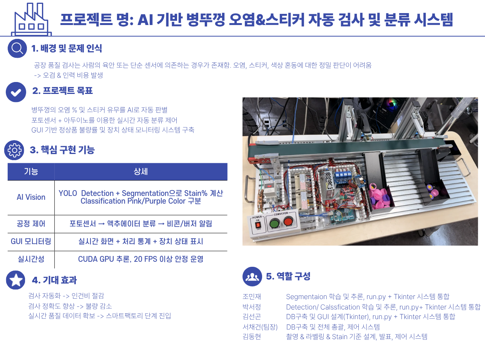

# 🏭OpenVINO 기반 공장 컨베이어 자동화 시스템 (2025.09.24 ~ 2025.10.22) [5인]  
> **병뚜껑(캡) 오염(스테인) + 스티커 부착 여부를 AI로 판별하고, 결과에 따라 현장 장비(비콘/부저/액추에이터)를 구동하는 자동 검사 시스템**

---

## 1) 프로젝트 소개
컨베이어로 이동하는 병뚜껑을 **카메라로 실시간 촬영**하고,  
**Object Detection(캡/스티커 위치 탐지) + Segmentation(오염 픽셀 분할)**을 결합하여  
**OK / NG(오염량 기준) / 스티커 NG / 캡 없음** 등을 판정하고, **로그 저장 및 장비 제어**까지 수행하는 품질 검사(QC) 프로젝트입니다.

---

## 2) 핵심 기능 (Core Features)
- ✅ **실시간 카메라 스트리밍 & 검사 트리거(게이트 센서 기반)**
- ✅ **캡 유무 판정** (NO_CAP)
- ✅ **오염(Stain) 면적 비율 계산** → 오염 기준에 따른 등급 분류 (OK / NG30 / NG80 등)
- ✅ **스티커 부착 여부 판정** (NG_STICKER)
- ✅ **GUI(Tkinter)로 상태/결과 시각화 + 결과 이미지 저장**
- ✅ **CSV/DB 로그 저장(옵션)**
- ✅ **릴레이/비콘/부저/액추에이터 제어(액추에이터 1/2 분기)**

---

## 3) 전체 시스템 구성 (Hardware)
### 3-1. 구성 요소
- **USB Camera**: 병뚜껑 상단 이미지 입력
- **센서(Inputs)**: 게이트/진입 감지 등 입력 신호
- **릴레이 보드(Outputs)**: 비콘/부저/액추에이터 제어
- **PC/Raspberry Pi(운영 PC)**: AI 추론 + UI + 로깅 수행

> 핀/릴레이 이름은 `iotdemo/pins.py` 기준으로 구성되어 있습니다.

### 3-2. 출력(릴레이) 매핑 예시
| 구분 | 이름 | 의미 |
|---|---|---|
| Output | BEACON_RED | NG 시 경광등(빨강) |
| Output | BEACON_YELLOW | 상태 표시(노랑) |
| Output | BEACON_GREEN | OK 시 경광등(초록) |
| Output | BUZZER | 부저 알림 |
| Output | ACTUATOR_1 | 분류 액추에이터 1 |
| Output | ACTUATOR_2 | 분류 액추에이터 2 |

### 3-3. 입력(센서) 예시
| 구분 | 이름 | 의미 |
|---|---|---|
| Input | SENSOR_1 | 캡 진입/게이트 센서 |
| Input | SENSOR_2 | 2차 센서(분기/타이밍용) |

---

## 4) 소프트웨어 구성 & 흐름 (Software Architecture & Flow)
### 4-1. 주요 모듈
- **CameraThread**: 카메라 프레임 수집/버퍼링
- **DetectionWorker**: 실시간 탐지(게이트 체크 후 스냅샷 큐로 전달)
- **DecideWorker**: 탐지+세그 추론, 오염비 계산, 최종 등급 판정, 저장/콜백
- **GUI(App, Tkinter)**: 화면 표시, 결과 로그, 액추에이터 제어 트리거
- **HW Adapter(iotdemo)**: 릴레이/센서 상태 읽기 및 출력 제어

### 4-2. 처리 흐름 (Pipeline)
1. **카메라 프레임 획득**
2. **게이트 센서 조건 만족 시 Snapshot 생성**
3. **Detection(캡/스티커 등)**
4. **Segmentation(오염 픽셀 분할)**
5. **오염 비율 계산(원형 ROI 기준 stain ratio)**
6. **최종 판정(OK / NG30 / NG80 / NO_CAP / NG_STICKER)**
7. **결과 저장(이미지/CSV/DB 옵션) + 장비 제어(액추에이터/비콘/부저)**

> 아래 이미지/도식은 프로젝트 폴더 경로에 맞게 수정해서 넣어주세요.

  

---

## 5) Detection + Segmentation을 함께 쓴 이유
### ✅ Detection(객체 탐지)을 쓰는 이유
- 캡이 **화면 어디에 위치하든 ROI(검사 영역)를 안정적으로 확보**할 수 있음
- **캡 없음(NO_CAP)** / **스티커 부착 후보(Sticker)** 같은 “객체 단위 판단”에 강함
- 조명/배경 변화에도 **Bounding Box 기반으로 관심영역을 빠르게 잡아냄**

### ✅ Segmentation(분할)을 쓰는 이유
- 오염은 **모양이 불규칙**하고 경계가 애매해서 “박스 하나로는” 정량 평가가 어려움
- 픽셀 단위로 오염 영역을 분할하면  
  → **오염 면적 비율(stain ratio)** 을 계산할 수 있어 **정량 기준(예: 30%, 80%) 등급화**가 가능

### ✅ 결론: 둘을 합치면?
- Detection으로 “어디를 검사할지(캡 위치)” 잡고  
- Segmentation으로 “얼마나 오염됐는지(픽셀 비율)”를 계산  
→ 현장 QC에서 요구하는 **정량 판정 + 안정적인 ROI**를 동시에 만족합니다.

---

## 6) 결과 등급(예시)
| 등급 | 의미 |
|---|---|
| NO_CAP | 캡이 감지되지 않음 |
| OK | 정상(오염 낮음) |
| NG30 | 오염 비율이 기준(예: 30%) 이상 |
| NG80 | 오염 비율이 높은 수준(예: 80%) 이상 |
| NG_STICKER | 스티커 부착/잔여물 판정 |

---

